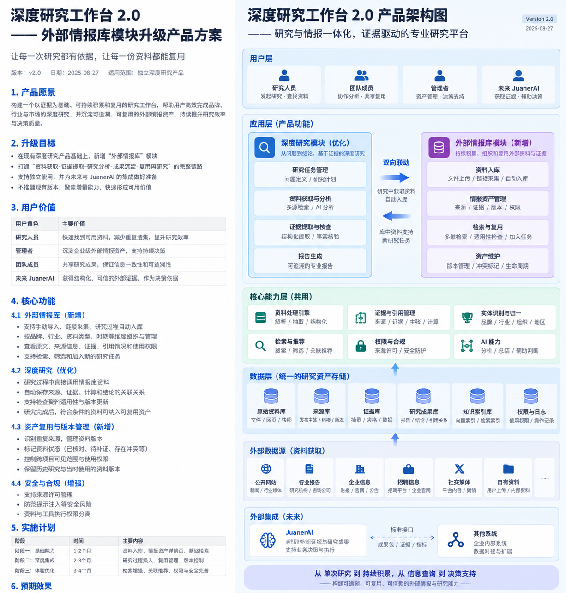
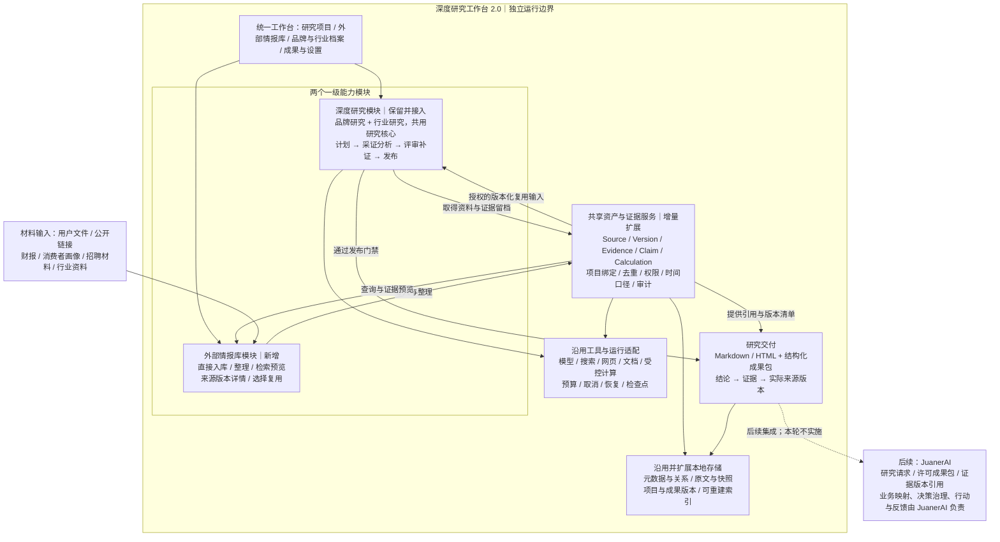

# 深度研究工作台 2.0
## 外部情报库与跨研究复用模块升级产品方案

> 文档版本：2.0
> 编制日期：2026-09-23
> 产品：独立深度研究工作台 / Deep Research Workbench
> 升级主题：外部情报库 × 共享证据资产 × 跨研究复用
> 文档性质：在现有版本上增量升级的产品方案与验收基线，不是重建整套产品的方案。
> 实现状态：用户确认已经开发一个版本；本次未读取当前仓库、数据库或运行记录，文中的模块、接口、字段和测试均为目标设计，不能视为已经实现。
> 适用对象：产品负责人、产品/开发 Controller、前后端与数据开发、研究质量评审、测试验收。
> 独立边界：不以 JuanerAI、Xanthil、企业四库、Analysis IR、Semantic Context Runtime、OSM、假设库或策略库作为本轮运行与验收前提。

---

## 0. 执行摘要

### 0.1 本次要做什么

在已经存在的独立深度研究产品中，增加 **外部情报库模块**，并让它与既有品牌研究、行业研究共用来源、原文版本、证据、主张、计算和引用关系。

产品形成两个一级能力模块：

- **深度研究模块**：围绕问题制定计划、采证分析、评审补证、生成与发布报告；品牌研究、行业研究仍是其中两个正式业务入口，共用一套研究核心。
- **外部情报库模块**：接收与整理外部材料，管理来源、口径、版本和权限，支持检索、预览以及加入新研究。

二者共用底稿，不通过"导出报告—重新解析报告—再次入库"的方式互通。报告继续面向人交付；结构化证据和资料版本同时面向系统保存与复用。

**最小价值闭环：资料先积累 → 研究可复用 → 新证据再沉淀。**

### 0.2 最关键的产品判断

| 判断 | 本方案要求 |
|---|---|
| 一个独立产品，不增加第二个独立情报产品 | 在现有工作台增加模块和页面，沿用已有运行与配置体系 |
| 增量升级，不重建研究引擎 | 保留品牌/行业研究的计划、采证、评审、补证、预算和交付链路 |
| 情报不必先变成报告 | 文件与链接可直接登记入库；只整理资料也能使用产品 |
| 报告不是唯一资产 | 来源、原文版本、证据、主张、计算与报告分别保存、相互关联 |
| 库内检索服务新问题 | 本轮先做好搜索、筛选、预览、人工选择、适用性检查与版本绑定 |
| 入库不等于已验证 | 保存状态、取得状态、证据核验、结论支持、复用权限分别表达 |
| 历史可追溯 | 研究绑定当时实际使用的资料版本，不随"最新版本"静默漂移 |
| 未来接入 JuanerAI | 保留稳定标识和成果包边界，不建设专属接缝，不直接写内部业务表 |

### 0.3 本轮完成的定义

> 第一次品牌研究留下可追溯的资料与证据；第二次行业研究能够找到这些资产、判断适用性并选择复用，按新问题补充缺失或需要更新的证据。两次研究分别绑定实际采用的来源版本，任何已发布关键结论都可以检查其依据与限制。

同时必须满足：情报库为空仍可研究；不发起研究也可入库；只有历史报告时可按真实取得情况收录，不伪造底稿；新增模块不破坏原有独立启动、双业务模块、取消、恢复与导出能力。

---

## 1. 建设基线与升级边界

### 1.1 已确认事项与待核查事项

| 类别 | 内容 |
|---|---|
| 用户已确认 | 现有深度研究产品已经做出一个版本；本次在该产品上增加情报库与跨研究复用 |
| 产品方向已确认 | 一个独立工作台、两个一级模块、共享资产、增量建设、后续连接 JuanerAI |
| 延续既有方案 | 品牌与行业研究均保留；证据链、研究评审、有限交付、独立运行仍为基线 [B1] |
| 当前尚未核查 | 实际前后端框架、项目目录、数据库结构、已有解析器、索引、证据对象与版本能力 |
| 本文提出的设计 | 新增页面、字段、状态、服务边界、工作包、迁移方法和验收用例 |

**"沿用"表示优先复用方向，不是宣称当前代码已经具备相应实现。** 开发前必须先核查，缺少关键来源或版本能力时先补最小基础，不把目标架构当作现状。

### 1.2 相对 v1.0 的变化

| 主题 | v1.0 产品基线 | 本次 2.0 增量 |
|---|---|---|
| 研究资产范围 | 以单个研究项目为中心保存 | 增加工作台内可检索、可授权复用的资产目录 |
| 跨项目复用 | 后续事项 | 搜索、筛选、人工选择、适用性检查与绑定进入本轮 |
| 资料入口 | 创建项目时提供，或研究中取得 | 增加不依赖研究任务的直接入库入口 |
| 证据治理 | 项目内追溯 | 扩展到来源去重、共享索引、跨项目引用与版本冻结 |
| 品牌/行业整理 | 服务当前研究 | 增加轻量档案与资产聚合，不建设企业本体平台 |
| 研究成果包 | 对外输出研究成果 | 补充版本引用、复用清单、权利与缺失状态 |
| 自动推荐、持续监测 | 后续 | 仍为后续，不因增加情报库默认纳入 |
| JuanerAI 集成 | 后续 | 不变；本轮只保留可对接的数据契约 |

本方案仅覆盖本轮增量。未明确修改的原研究质量、品牌/行业专项规则与独立运行边界继续作为目标基线；是否已通过旧基线验收由实际测试确认。[B1]

### 1.3 本轮明确不做

不建设全网采集与反爬平台、登录态或付费资料绕过、社交平台全量采集、问卷与访谈平台、独立消费者研究模块、自动竞争监控推送、全自动推荐与自主持续研究、完整企业知识图谱、四库平台、多租户权限与计费、复杂分布式调度、专属 JuanerAI 集成、经营动作执行。

消费者画像、财报、招聘信息是本轮优先资料类型，不等于附带这些领域的全量数据库、专有数据获取权或新的研究引擎。

---

## 2. 产品定位、用户价值与范围

### 2.1 升级后的产品定义

**深度研究工作台 2.0 是一个可以独立使用的品牌与行业研究工具，同时具备外部情报积累、证据管理和跨研究复用能力。**

它既可以从问题出发完成研究，也可以从资料出发建立积累；不是只保存报告的网盘，也不是把检索结果直接当成经营决策的自动系统。

产品定位无需因本轮升级重新命名。对用户继续展示"深度研究工作台"，通过"外部情报库"入口表达新增能力。

### 2.2 用户与关键任务

| 用户任务 | 原先容易出现的问题 | 本轮目标行为 |
|---|---|---|
| 平时收集品牌资料 | 材料散落，只有研究时才整理 | 直接入库并关联品牌、时期和来源，日后检索 |
| 开展新的品牌研究 | 重复寻找已取得的材料 | 在新任务内选择相关资产，核对版本和口径后使用 |
| 从品牌研究扩展到行业研究 | 只复用报告文字，丢失底层依据 | 复用适用的来源和证据，不把单品牌结论外推到行业 |
| 查证一个旧结论 | 不知道当时看了哪份材料 | 从报告定位到当时绑定的证据与原文版本 |
| 更新资料 | 新文件覆盖旧文件，旧报告失去解释性 | 新建资料版本或新期资料，旧研究保持绑定 |
| 整理只有报告的历史项目 | 误把摘要和判断当成核验事实 | 收录为历史研究成果，显示底稿缺失并允许后续补证 |

### 2.3 价值验证原则

希望减少重复查找、提高引用完整性并形成可持续积累的研究资产，但不预设节省时间比例、事实准确率或商业收益。

采用冻结资料测试与真实研究样本观察：是否少做了无必要的重复取得、是否适当地使用了旧资产、是否补充了新证据、是否保留来源和反证，而不是只统计入库数量或引用数量。

---

## 3. 产品架构 2.0

### 3.1 产品架构图



图片为目标产品架构，不是现有系统运行截图。蓝色表示既有方案基线与优先沿用，绿色表示本轮新增或增强，灰色虚线表示后续集成。蓝色不代表已审计通过。

本图中"共享"指同一独立工作台内、受项目范围与使用授权约束的复用，不表示所有资产自动公开，也不表示本轮建设团队协作。

### 3.2 分层职责

| 层级 | 职责 | 约束 |
|---|---|---|
| 统一工作台 | 研究项目、情报库、品牌/行业档案、成果与设置 | 不直接操作数据库表或绕过服务端权限 |
| 深度研究模块 | 品牌/行业问题配置、计划、采证、分析、评审补证、发布 | 不复制情报库来源体系，不重建第二套研究核心 |
| 外部情报库模块 | 入库、整理、详情、检索、筛选、复用管理 | 不把收录和搜索结果自动认证为事实 |
| 共享资产与证据服务 | 来源、版本、证据、主张、计算、项目绑定、审计 | 是统一资产读写边界，不是新 Agent 平台 |
| 工具与运行适配 | 沿用模型、搜索、网页、文档和受控计算能力 | 统一预算、权限、错误和取得状态 |
| 本地存储与索引 | 元数据、关系、原文/快照、成果、检查点、可重建索引 | 沿用并扩展，不强制换数据库或建立向量服务 |
| 研究交付 | Markdown/HTML 报告及结构化研究成果包 | 绑定同一成果版本，保留限制与缺失 |

### 3.3 两种内部数据流

**研究沉淀流：**研究采证 → 保存实际取得的材料与取得记录 → 提取定位证据 → 形成主张/计算 → 评审和发布 → 符合权限的资产进入可复用范围。

**资料复用流：**直接导入或历史积累 → 检索与预览 → 用户选择 → 适用性及权限检查 → 固定版本绑定 → 进入新研究的采证与评审上下文。

两条流共用资产服务。成果包主要用于导出、备份与未来跨产品传递；同一工作台内不以 ZIP 文件交换或报告再解析作为常规服务接口。

### 3.4 可编辑 Mermaid 架构



图示表达逻辑关系，不要求部署微服务或消息集群。预算、权限、审计与错误处理贯穿所有路径，不只在单个框内生效。

---

## 4. 本轮功能清单与优先级

本节 **U2 必交** 是本次升级验收范围，不等于从零重做原来全部功能。已有合格能力可直接复用，但须有核查与回归记录。

| 编号 | 功能 | 本轮最低交付要求 | 主要边界 |
|---|---|---|---|
| U2-01 | 资料直接入库 | 支持现有许可文件导入、链接登记；不必先创建研究 | 登记链接不等于读取正文 |
| U2-02 | 研究过程留档 | 采证时登记来源版本，分析时登记证据引用 | 必须从流程中保存，不靠最终报告猜测底稿 |
| U2-03 | 资产列表与详情 | 展示来源、原文定位、时间、口径、取得状态、限制与使用记录 | 原文缺失必须可见 |
| U2-04 | 品牌/行业整理 | 基于实体编号、类型、时期、地区、标签整理 | 不按名称相似自动合并实体 |
| U2-05 | 检索与筛选 | 对有权访问的材料做基础检索、筛选和片段预览 | 不强制语义检索与自动推荐 |
| U2-06 | 加入研究与版本绑定 | 用户选择资产，服务端检查权限和适用性，绑定实际版本 | 相关性不能替代授权或口径检查 |
| U2-07 | 去重与版本管理 | 识别精确重复、标记同源转引、保留更正版本 | 不把同源材料当作独立证据 |
| U2-08 | 生命周期与复用控制 | 区分项目留档、工作台可复用、归档、撤回/禁止新使用 | 共用资产不自动扩大权限 |
| U2-09 | 历史项目兼容 | 完整底稿、部分底稿、只有报告三类路径 | 不回填虚构来源，不破坏旧项目 |
| U2-10 | 成果包与运行回归 | 导出版本化引用、复用清单与限制；双研究模块通过回归 | 失败、中断、部分交付状态必须真实 |

**允许后续增强：**向量或混合检索、自动推荐、跨来源自动冲突发现、高级差异分析、定时监测、多工作台协作、完整结构化财务分析、专属系统集成。

---

## 5. 核心用户流程

### 5.1 流程 A：不研究，先收集资料

1. 用户进入外部情报库，导入文件或登记公开链接。
2. 系统创建入库任务，保存用户提交方式、授权范围和处理状态；取得与解析分开记录。
3. 从可读内容提出发布者、品牌/行业、时期、资料类型等候选字段；用户可确认或保持未知。
4. 检查精确重复、可能的同源材料和资料版本关系。
5. 保存原文或允许保留的快照，生成稳定版本编号和正文定位；无法取得时仅登记入口。
6. 展示资产详情；是否允许跨项目使用由授权及复用规则决定。

批量导入须逐项显示成功、重复、等待确认、失败，不用一个"全部完成"掩盖部分失败。来源缺页码、发布时间或样本说明时保留未知，不为完成表单生成虚构值。

### 5.2 流程 B：新研究选择已有资产

1. 用户创建品牌或行业研究，确定问题、对象、地区、时期、信息截止点及外发设置。
2. 在"选择已有情报"中搜索、筛选、查看资料片段及原始位置。
3. 用户选择材料；系统分别列出可作为证据候选、仅可作线索、需补证、权限不允许等情况。
4. 用户确认后生成固定版本的 `AssetBinding`，记录用途与适用性说明。
5. 研究将这些资产作为候选输入，按新问题核查证据与口径，必要时继续检索新材料。
6. 评审检查已有材料是否被过度外推、是否忽略反证和更新信息。

用户选中一项待核验材料，可以表示"研究这个线索"，不能自动把它加入"已确认关键事实"。外发权限不足时，不将相关正文或敏感摘要发送给外部模型；采用许可路径或等待用户处理。

### 5.3 流程 C：研究中发现资料并沉淀

研究读取成功后立即保留实际材料与版本；原文定位与证据随提取过程创建。最终报告发布不是保存原文的唯一触发点，因此失败、中断或有限交付的任务仍可保留已经有效取得的材料。

留档成功后，符合预设规则且权限清楚的来源可以自动进入可检索范围；敏感、归属不明、仅转引或解析有问题的内容，保持项目范围或进入待处理队列。**不要求每条普通资料都人工审批，但也不允许模型自行扩大跨项目使用权限。**

报告主张与研究建议仍是派生资产。发布后的报告可供导航、回顾与新任务提出问题，不作为自己的独立证明。

### 5.4 流程 D：更新、纠错与历史回看

新材料到来后，区分三种行为：同一文件重复取得、同一期材料出现更正版本、新时期产生另一份材料。

更新可以改变情报库默认展示，也可标记受影响的研究；不能静默替换已绑定的原文。旧研究打开时展示原版本及后来更正/撤回提示。需要更新结论时创建新研究运行或成果版本，重新评审。

本轮采用明确的版本关系与影响项目列表即可，不要求自动识别所有语义变化或自动最小重算。

---

## 6. 优先资料类型与结构化要求

### 6.1 消费者画像

应保存发布机构、调查或分析方法说明、目标品牌、平台/渠道、地区、数据期间、样本范围、样本量（有披露时）、指标定义及实际比例/数值。

关注者、内容互动者、访问者、购买者和会员必须区分。某平台样本不能自动扩大成全渠道消费者；只获得研究报告不等于获得原始问卷；核对报告表格不等于独立核验整个调查。

消费者画像在本轮作为品牌研究材料使用，不新增问卷采样、访谈或消费者研究平台。

### 6.2 财报与经营披露

应保存披露主体、品牌/集团归属、报告期、币种、单位、合并或分部范围、指标定义、披露/估算属性、更正状态及对应页码或表格。

原始文件供追溯；可靠提取且经确认的少量指标可以保存为结构化观察值。表头、单位、脚注或所属主体不明时，不能默认为标准数据。

**下一年度财报通常是新资料对象；同一年度财报的更正版才属于同一资料的版本演进。** 不将两者一律视为"旧文件升级"。

本轮不承诺任意财报格式自动完整解析，也不建设财务数据库或通用 BI。

### 6.3 招聘信息

应保存发布主体、岗位、地区、职能、岗位说明、发布时间（实际可得时）、观察/取得时间、来源定位和重复发布线索。

同一岗位在多渠道重复发布不得直接累计成净新增人数；发布岗位不等于实际入职、净扩张或已完成战略转型。招聘描述属于观察证据，扩张方向属于待验证推断，需其他资料支持。

本轮支持已有文件、用户提供材料与许可公开页面，不承诺持续抓取招聘平台。

### 6.4 行业及其他材料

行业规模、趋势、预测与份额需保留行业边界、地区、口径、历史/估算/预测属性、发布时间和目标期。研究核心继续接受其他有权使用的外部材料，但适用性和解析能力由实际支持情况决定。

"头部品牌"可以是资料整理标签或用户选择的研究对象。涉及排名事实时需登记排名指标、地域、时期及来源，不把人工标签当作永久市场排名。

---

## 7. 来源、证据与派生结论的组织方式

### 7.1 不是把二手报告变成一手资料

本方案采用以下设计语义：

| 层次 | 内容 | 是否可单独作为已核验事实 |
|---|---|---|
| 原始取得物 | 实际读取的网页、文件、表格或用户材料 | 否；取得只是技术状态 |
| 来源与版本信息 | 发布者、取得方式、时间、哈希、原文位置 | 描述材料，不自动证明内容 |
| 证据 | 原文中的具体陈述、摘录、数值及其适用范围 | 需与目标主张对应核查 |
| 主张与计算 | 研究提出的判断、解释、估算和可复算结果 | 需保留支持/反对依据、方法和限制 |
| 研究报告 | 对发现与证据的综合表达 | 是派生成果，不能替代底稿 |

"一手/二手"不按文件扩展名固定判断。记录某条主张的直接披露者、实际取得来源、转引链和核验层级。研究机构报告可以直接披露其调查；媒体文章可能只转述；工作台的综合研究形成新的分析。

### 7.2 有上游引用，不代表已经取得上游原文

只取得媒体 X 转引机构 M 的文章时，证据绑定媒体 X 的实际版本；机构 M 的报告登记为上游引用候选，并标记尚未取得。

允许表述"媒体 X 转引机构 M 称……，原始调查与样本口径尚未核对"；不能表述"经核验，机构 M 的原始报告显示……"。后来取得原文，新增取得与核验记录，不改写历史。

### 7.3 防止循环引用与虚假独立证据

同一来源可以支持不同主张，但相同原始出处的转载不算相互独立的佐证。自有报告必须带派生关系和工作台来源标记，新任务引用历史报告时应能进一步展开到外部来源。

本轮至少实现稳定 ID、原始出处字段、精确内容重复识别、人工确认的同源关系和派生链检查。对不确定的同源关系保持待确认，不承诺识别全部传播链。

出现自我引用或闭环依赖时，不允许将其计作额外独立支持。已发布的历史结论可被检索，但必须标为历史分析，不自动继承对新问题的支持状态。

---

## 8. 最小数据模型与时间语义

### 8.1 逻辑对象

下列是逻辑对象，可以合并到现有表、JSON 字段或文件结构中，不要求一对象一数据库、一对象一服务。

| 对象 | 作用 | 关键字段 |
|---|---|---|
| `Source` | 一份可识别的资料及其逻辑身份 | source_id、标题、发布主体、类型、原始出处、关联实体 |
| `SourceVersion` | 该资料实际取得的内容版本 | version_id、source_id、内容引用、内容哈希、发布时间、更正关系 |
| `AcquisitionRecord` | 一次取得/导入及授权上下文 | acquisition_id、version_id、项目、取得时间、方式、读取范围、权限 |
| `Evidence` | 精确定位的内容或数值 | evidence_id、revision、version_id、locator、摘录、口径、提取记录 |
| `Claim` | 对研究问题提出的主张 | claim_id、revision、类型、文本、支持/反对证据、适用范围、评审 |
| `Calculation` | 可复算的计算 | calculation_id、输入证据版本、公式、参数、单位、代码/执行版本、输出 |
| `Entity` | 品牌、集团、行业等轻量对象 | entity_id、类型、名称、别名、归属关系、确认状态及依据 |
| `AssetBinding` | 某运行选择了哪个资产版本 | binding_id、run_id、asset_id、精确版本、用途、截止点、检查结果 |
| `UsageRecord` | 资产实际被使用的记录 | run_id、binding_id、步骤、提供给模型/评审的内容版本、报告引用位置 |
| `ReviewRecord` | 某对象在某范围下的核验 | 对象和版本、范围、检查类型、结果、原因、时间、责任主体 |
| `ResearchResultBundle` | 同一研究成果的交付集合 | 请求/运行/成果版本、报告、引用、证据、计算、限制、文件清单 |

对同一文件的存储去重，不合并不同取得记录的授权。内容哈希只辅助识别相同内容和完整性，不能证明材料真实或授予使用权。

### 8.2 元数据应该挂在哪里

| 元数据 | 归属 |
|---|---|
| 发布者、资料标题、资料类型 | Source；变更或不确定状态保留记录 |
| 实际正文、版本哈希、更正说明 | SourceVersion |
| 某项目何时取得、是否允许留存与外发 | AcquisitionRecord 与权限记录 |
| 品牌/集团、地区、渠道、样本、单位、指标定义 | Evidence 的适用范围；Source 可提供默认候选，但不得盲目继承 |
| 支持程度、反证、推断成立条件 | Claim 与 ReviewRecord |
| 该次研究实际选中什么 | AssetBinding 与 UsageRecord |

一份资料有多个表格与时期时，各证据保留自己的口径。整个文件的"年份""地区"标签不能覆盖不同表格的实际范围。

### 8.3 必须区分的时间

| 时间 | 含义 |
|---|---|
| `data_period` | 被描述的数据所属期间 |
| `published_at` | 来源标示或可核查的发布时间，未知可为空 |
| `available_at` | 材料在外部最早可用时点，仅在有依据时记录 |
| `acquired_at` | 当前系统实际取得材料的时间 |
| `recorded_at` | 当前记录写入系统的时间 |
| `reviewed_at` | 核验实际发生的时间 |
| `as_of` | 当前研究允许采用信息的截止点 |

历史研究区分两种任务：

- **当时可公开获得什么**：需要有依据的公开可用时间。今天取得旧文件，不足以单凭文件正文日期证明它在历史时点可得。
- **系统当时实际知道什么**：以当时取得记录、绑定清单和使用日志为准，不允许倒填。

本轮不必自动完成历史网页考据；可用时间无法确认时必须披露限制，不能绕过截止规则。

### 8.4 固定版本绑定

运行开始或明确增补输入时，生成绑定快照，至少固定来源版本、证据修订、请求范围、研究配置与权限检查记录。后续新增输入记录新的绑定事件或快照，不悄悄修改旧快照。

报告中的引用应指向固定版本，不指向随时变化的"最新"别名。原文相同但解析器生成了不同片段时，保留提取版本，防止证据定位漂移。

历史回放保证依据和处理记录可以核对；不承诺再次调用外部模型会逐字生成相同文本。

---

## 9. 状态、治理与权限

### 9.1 不用一个"已入库"状态表示全部质量

| 维度 | 建议状态 | 说明 |
|---|---|---|
| 取得状态 | DISCOVERED / SNIPPET_ONLY / READ_PARTIAL / READ_FULL / UNAVAILABLE | 说明真正拿到多少内容；READ_FULL 指所需正文已取得，不等于每个图表都解析正确 |
| 提取核验 | UNCHECKED / VERIFIED_AGAINST_SOURCE / EXTRACTION_ISSUE | 说明摘录/数值是否与指定原文版本一致 |
| 主张支持 | SUPPORTED / PARTIALLY_SUPPORTED / CONTRADICTED / UNRESOLVED | 只针对指定问题、证据和范围，不是永久真理标签 |
| 复用范围 | PROJECT_ONLY / WORKSPACE_REUSABLE / RESTRICTED | 说明允许在哪些范围使用，不等于事实已核验 |
| 生命周期 | ACTIVE / ARCHIVED / WITHDRAWN | 归档与撤回区别；撤回通常禁止新使用并提示旧引用 |
| 任务适用性 | ELIGIBLE / LEAD_ONLY / NEEDS_REVIEW / NOT_APPLICABLE / FORBIDDEN | 在某个新研究内计算，不应成为全局永久状态 |

"入库成功"仅表示材料或元数据按声明范围成功保存。质量、真实性、适用性与权限必须独立展示。

### 9.2 复用检查的顺序

先判断访问与使用授权，再判断对象、范围、时间、取得完整性、证据支持和来源独立性，最后决定以证据候选、线索或待补证内容的身份进入研究。

材料在新任务中可以是有效的历史背景，而不适合证明当前现状；材料被撤回或含已知提取错误时，不得继续以原质量标签用于新关键结论。

不能仅靠"资料超过若干天"判断过时。财报、招聘和消费者调查具有不同适用期限；本轮采用任务级时间检查与可配置提示，不自动承诺联网更新。

### 9.3 单用户本地也要保留的权限边界

权限至少区分：本地留存、项目内查看、跨项目复用、向外部模型发送、向外部解析器发送、随成果导出全文或摘录。

用户上传不是自动全授权；公开网页可访问也不代表可无限复制分发。未知的全文导出或外发权利默认不放行，允许用户登记已有授权或采用限制性引用路径。

服务端在搜索结果、片段预览、原文读取、绑定、模型上下文组装和导出阶段均检查权限。禁止只在前端隐藏列表；搜索计数、标题和摘要也不得泄露项目限制内容。

同一内容的不同取得记录可能具有不同权利：共享底层文件不应让受限项目利用另一个项目的身份或许可。

### 9.4 原文不可继续保存或资产撤回

归档不是删除；撤回不等于抹掉历史。已有研究保留允许留存的来源元数据、原引用和当前不可用原因，并标记该成果可能需要复核。

用户要求永久删除时，先展示被引用项目和可保留范围，明确确认后执行删除并清理索引、缓存和受影响导出缓存；只能保留依法且获授权可保留的最小审计信息。不能以"历史可回放"为理由无限留存必须删除的正文。

已复制到产品之外的文件和供应商已接收的内容不在本地删除能力保证范围内。

---

## 10. 检索与研究复用策略

### 10.1 本轮检索能力

沿用现有可用检索方案，优先覆盖标题、发布者、实体别名、资料类型、时期和已提取正文的关键词检索；提供品牌/行业、地区、类型、日期、取得状态、可复用范围等筛选。

中文品牌、中文正文、英文别名和数字口径必须用实际测试验证召回。未经验证不能仅因"已建立索引"宣布中文检索可用。现有索引不满足要求时补适配能力，不预先指定必须引入某个向量产品。

展示命中片段、来源版本、日期、类型和限制。搜索分数只用于相关性排序，不显示为真实性概率。

### 10.2 复用粒度

支持以来源资料为主进行选择，并能够展开到实际证据。原文很长时，不将全部内容无差别塞进模型；提取与问题相关、权限允许的片段，保留截断说明和位置。

结构化证据可以精确复用；历史报告和主张可以作为研究线索。不同角色获得必要的实际内容与引用，不只获得"库中存在这个资产"的 ID 列表。

### 10.3 空库、索引故障与检索不足

空库不阻断研究，显示无可复用资产并进入正常采证。索引延迟或损坏时明确提示，允许按来源列表或项目引用访问已保存资料；索引可重建，不视为原文丢失。

没有找到材料不等于材料不存在；检索命中也不等于适合当前问题。用户可继续外部采证或手工添加资料。

---

## 11. 页面与关键交互

### 11.1 导航建议

| 入口 | 本轮变化 |
|---|---|
| 研究项目 | 沿用；增加"选择已有情报""已复用资料""本次新增证据" |
| 外部情报库 | 新增；列表、筛选、入库、详情、版本与使用记录 |
| 品牌与行业档案 | 轻量新增；实体关联的资料聚合，不是完整经营看板 |
| 成果 | 沿用；增加完整证据链与实际使用资产版本展示 |
| 设置 | 沿用；补充默认复用范围、资料留存与外发策略 |

品牌研究与行业研究作为研究模块的两个入口保留，不能在升级时其中一个退化为占位页。

### 11.2 情报库列表

每条记录展示标题、资料类型、对象、发布/数据时期、来源、取得状态、是否可复用和最新处理状态。提供导入、搜索、筛选、查看详情、加入研究、归档等动作。

不把"已入库""已核对摘录""支持某个结论"混成一个绿色标记。批量操作显示逐项结果与限制。

### 11.3 资产详情页

推荐三栏或分区：原文/快照及定位；元数据、口径、来源关系与版本；证据、引用项目、核验记录与限制。

主动作包括"加入研究""查看该版本""补充原始来源""更正元数据""设为项目范围""归档/撤回"。影响已发布研究的更正需展示受影响项，不静默批量改写旧报告。

### 11.4 复用选择器

按研究问题提供搜索与筛选，用户选择后显示四组信息：选择理由、适用范围、风险/缺口、实际版本与权限。确认前允许移除材料或标记"仅作线索"。

不以强制复杂表单阻碍使用。已确认的元数据可以预填，关键对象与口径不明时才要求处理。

### 11.5 品牌/行业档案

采用实体名称、别名、所属行业/集团、关联资料、已有研究和待核验信息的轻量聚合。可能同名对象先分别保留；合并需依据并可追溯，不按字符串相似度自动决定。

关系只表达已记录事实或候选关系，不将"品牌属于某行业"的连线当作因果推断能力。

---

## 12. 技术实施边界与接口契约

### 12.1 优先沿用现有技术栈

开发前盘点实际存储和工具。优先在现有项目中增量增加资产服务、数据字段、索引与页面，不为本轮目标强制更换前后端框架、Agent 框架、数据库或部署形态。

若现有实现只有散落文件而无可靠元数据，可采用"本地元数据存储 + 受管理文件目录 + 可重建索引"的最小实现；具体技术在代码核查后确定。本方案不要求图数据库、独立向量服务或分布式消息系统。

### 12.2 服务边界与拟议接口

接口可先是同进程方法或已有后端路由，不要求对外公共 API。以下为逻辑契约，名称不是对现有代码的声明。

| 能力 | 输入重点 | 输出/约束 |
|---|---|---|
| `register_asset` | 文件/URL 引用、来源信息、项目、授权、幂等键 | 入库任务 ID 与逐项状态；不把入口登记当作正文读取成功 |
| `ingest_research_source` | run_id、实际取得物、取得记录 | source_id、version_id、acquisition_id；可重试去重 |
| `search_assets` | 查询、过滤、当前项目、访问上下文 | 许可结果、定位片段、版本、适用性提示 |
| `get_asset_version` | 精确版本、访问上下文 | 原文/许可片段或明确不可用原因 |
| `check_reuse` | run_id、资产版本、用途、信息截止点 | 许可/阻断、线索/证据候选、缺口与原因 |
| `bind_assets` | 请求版本、候选版本、确认、幂等键 | 不可静默覆盖的绑定快照；服务端再次检查 |
| `record_evidence` | 来源版本、定位、摘录/数值、口径、提取信息 | 证据修订及校验问题 |
| `change_reuse_scope` | 资产、目标范围、授权依据、确认 | 范围变更与审计；不扩大原始使用许可 |
| `withdraw_asset` | 对象/版本、原因、确认 | 禁止新使用状态、受影响引用清单 |
| `export_result_bundle` | 成果版本、导出范围、许可上下文 | 一致成果包、缺失/删减说明和校验清单 |

### 12.3 文件与元数据提交

文件先写入受控临时位置，完成完整性检查后登记完成状态并纳入正式引用；中断产物保留为待恢复或失败，不出现在可用清单中。

数据库与文件系统不能假装天然共享一个原子事务。使用暂存状态、完成标记和启动时协调检查处理半写入；重试用幂等标识和稳定对象关系防止重复登记。已提交资产的索引更新可延后，必须显示索引状态且可重建。

允许保留兼容的原项目存储，不要求首次升级就搬迁全部原文。统一的是引用与访问契约，不是必须重排所有物理目录。

### 12.4 研究流程接入点

| 接入点 | 改动 |
|---|---|
| 需求/计划确认 | 增加可选已有资产选择与使用目的 |
| 资料读取完成 | 保存取得记录与实际版本，再向后续阶段传递引用 |
| 证据分析 | 绑定原文定位、口径与证据修订 |
| 模型/评审上下文组装 | 解析授权引用为实际片段，保留限制与截断 |
| 发布前核查 | 检查引用闭合、版本、口径、权限与受限事实 |
| 任务完成或中断 | 保留有效过程资产，区分结果质量与资产可复用状态 |

共享资产写入失败时不能宣布相关证据已沉淀或已可复用。若既有安全项目存储可以可靠保留底稿，允许明确标为"项目已保存、共享登记待处理"；若关键证据无法持久化，则阻断正式发布。不能用降级掩盖证据丢失。

### 12.5 成果包增量

```text
research-result/<result_version>/
  report.md
  report.html
  findings.json
  claims.jsonl
  sources.jsonl
  source_versions.jsonl
  evidence.jsonl
  calculations.jsonl
  asset_bindings.jsonl
  review_summary.json
  limitations.md
  manifest.json
  permitted_assets/        # 仅包含被许可转交的材料或片段
```

`manifest.json` 至少保留 schema 版本、项目/请求/运行/成果版本、配置版本、文件哈希、执行状态、成果质量、资产版本清单、删减与缺失原因。

禁止导出密钥、未授权原文、任意本地路径、隐私日志或可执行文件。未包含原文时准确说明"引用可追溯但接收方未必能访问"，不把仅有 ID 的包称为完整可复验包。

---

## 13. 历史项目迁移与回滚

### 13.1 先核查，不先迁移

实施前形成只读盘点：旧项目数量、实际字段、已有来源/证据/报告关系、文件是否存在、取得与授权记录是否完整，以及品牌/行业当前可通过的基线场景。

提供迁移预演报告、数据库与文件备份、影响列表和恢复验证。未经既有审批流程，不直接改写用户历史资料或开发模式。

### 13.2 三类历史资产

| 历史情况 | 处理方式 | 禁止事项 |
|---|---|---|
| 原文、证据与引用完整 | 增量登记资产目录与版本映射；保留原项目路径或建立兼容读取 | 不重编号导致旧引用失效，不默认扩大授权 |
| 只有部分原文或引用 | 只迁移实际存在对象；记录缺失和断链；允许补证 | 不从报告措辞推断未见原文，不补造页码 |
| 只有最终报告 | 收录为历史派生研究成果；标记底稿未取得/不完整 | 不拆成一批"已核验外部事实" |

后来补齐原文时记录新的取得时间、核验记录与关联关系；不能倒填成历史任务当时已经查阅。

### 13.3 建议迁移步骤

**备份与预演 → 新字段/表或侧表 → 旧 ID 映射 → 少量样本登记 → 引用与权限验证 → 批次执行 → 新旧兼容回归 → 用户确认切换。**

以新增字段、侧表和兼容读取优先，不采取破坏性覆盖。暂不能证明可靠的对象保持原样并记录待处理项。是否搬迁原文与何时清理冗余文件，另经验证确认。

### 13.4 回滚原则

新增功能采用开关或明确的入口控制。回滚可关闭情报库与复用路径，保留新增资产和审计，不能删除升级后生成的数据来恢复旧界面。

结构迁移与应用版本回滚分别设计。若旧版本无法读取新增 schema，应采用经测试的兼容路径或恢复前快照，并明确处理升级后的新增数据；不得直接运行未经验证的旧版本覆盖数据库。

---

## 14. 安全、可靠性与质量门禁

### 14.1 外部材料始终是数据

来源正文中的任何指令都不能改变系统角色、调用权限、预算、输出位置或资料外发设置。网页或文档不能通过"请执行此命令"获得本地代码、文件或密钥访问权。

入库解析与工具执行分离。文档脚本、宏和嵌入内容不执行；HTML 预览与报告按不可信内容渲染。URL 取得沿用并核查公开网络目标限制、重定向检查、体积和超时限制，不允许用情报导入接口访问本机或私有服务。

### 14.2 新增模块的运行可靠性

入库任务也应有取消、有限重试、恢复、逐项结果和资源限制。认证失败、授权不足与永久不可读不要无限重试。重复点击不得产生多个逻辑相同任务。

研究取消后停止后续采证派发，已提交且有权留存的材料可以保留，但不能把未完成研究记为已发布成果。外部在途调用状态不确定时如实记录。

### 14.3 发布门禁

正式关键事实应有实际证据与精确位置，证据对主张具有支持关系，并满足对象、时间、口径和权限要求。存在致命冲突、虚构引用、越权资料或关键计算错误时，移除错误主张或阻断发布。

资料不足允许有限交付，但必须明确缺口，不能把未取得原文的转引变为"已核验事实"。报告、摘要、表格和成果包都采用同一成果版本；任何修改关键事实的编辑必须重新检查相关内容。

程序负责引用存在、字段、权限、计算和版本等确定性检查；研究评审负责语义支持、外推与反例；人工抽检保留。不能用模型给出的总体高分覆盖阻断项。

---

## 15. 端到端产品示例

本章使用虚构资料与数字，仅用于说明目标行为，不是对真实品牌或行业的事实陈述。

### 15.1 第一次：品牌 A 研究

用户研究品牌 A 的人群与经营线索。系统实际取得三份材料：某调查机构的画像报告、品牌所属集团的经营披露、某招聘页面。

画像报告的一张表描述某平台品牌关注者样本，女性比例为 62%。系统保留该表的位置、样本定义、调查时期和实际来源版本。它只能支持"该调查的关注者样本中女性占比较高"，不能改为"品牌全部购买者的女性比例为 62%"。

集团披露只含集团收入，没有分品牌收入；系统保留"未取得分品牌披露"。招聘页面出现某岗位，只记录招聘发布事实，将可能的业务方向列为待验证线索。

研究完成后，报告和上述来源、证据、主张分别保存。允许跨项目使用的材料进入情报库，其余保持项目范围。

### 15.2 第二次：细分行业研究

用户创建行业研究，在情报库中找到上述材料。系统指出：品牌 A 资料适合做代表品牌案例，不能代表全行业消费者或直接推算行业规模。

用户将画像证据作为品牌案例输入，把招聘线索标为待补证，并继续采集其他企业与行业口径材料。新报告引用原证据版本，保留其样本限制；若使用集团数值进行计算，必须满足新任务的范围要求，否则不计算。

这次研究既复用了旧材料，也产生了新的行业证据；不会因为旧报告"已通过"就免除新任务评审。

### 15.3 后续更正

调查机构发布同一期画像报告更正版。情报库登记新版本，保留旧版本与更正关系；前两次研究仍指向其当时使用的内容，同时显示后来更正的提示。

用户发起更新研究后才采用新版本、形成新主张和新成果。旧报告不会在无人确认时自动改数。

---

## 16. 实施工作包与里程碑

不预设固定月数，不以未经核查的图中工期作为承诺。开发 Controller 在完成代码盘点和依赖确认后估算工作量，沿用现有需求、门禁、拆解和编码组织方式。

| 工作包 | 核心任务 | 交付物 | 放行条件 |
|---|---|---|---|
| U2-WP00 基线核查 | 只读盘点现有版本、存储、接口、解析和双模块行为 | 现状/缺口表、样本、边界、数据保护与回滚计划 | 不把原方案当现有实现；改动范围获确认 |
| U2-WP01 契约与版本 | 来源、取得、证据、版本、绑定和权限设计 | 数据契约、兼容策略、基础测试 | 来源/权限/版本可区分，旧引用不失效 |
| U2-WP02 直接入库 | 文件/链接登记、处理状态、精确去重、基本整理 | 入库服务与资产列表/详情 | 可独立入库，部分失败可见 |
| U2-WP03 共享检索 | 授权检索、过滤、预览、实体聚合 | 检索服务、档案页、中文检索测试 | 无权限泄露，能找到冻结测试资料 |
| U2-WP04 研究接入 | 采证留档、选择复用、适用性检查、版本绑定、上下文供给 | 完整研究—资产闭环 | 第二次研究使用真实版本与证据，不重解析自己的报告 |
| U2-WP05 生命周期与迁移 | 更正、归档、撤回、影响引用、历史三类兼容 | 迁移脚本/预演、备份恢复与审计 | 无虚假补齐、无静默覆盖、可回滚 |
| U2-WP06 交付与验收 | 成果包、权限/故障测试、双模块回归、端到端案例 | 验收报告、升级说明、已知限制 | 必交功能通过，阻断问题清零 |

实施顺序以契约和版本为先；UI、检索、研究接入可在接口冻结后受控并行。权限与可靠性从首个工作包开始，不最后补丁式加装。

**M0 基线和契约明确；M1 不研究也可入库；M2 新研究可以检索选择并正确绑定；M3 两次研究完成复用闭环；M4 迁移、安全、故障和双模块回归通过。**

---

## 17. 验收方案

### 17.1 样本组织

使用两类证据：固定资料与预期结果构成可重复回归集；经许可的真实品牌/行业任务验证实际可用性。

建议本轮至少保留品牌、行业各两条真实任务回归，并执行一次"品牌研究 → 行业研究复用"的跨任务演示。原版本已批准的其他必要用例继续执行，不因本轮升级减少原有质量基线。实际数量、人工抽检范围和性能测试数据规模在 WP00 冻结。

### 17.2 功能、证据与边界用例

| 编号 | 场景 | 必须满足的断言 |
|---|---|---|
| A-01 | 情报库为空开展研究 | 品牌和行业均可独立执行，不强制先入库 |
| A-02 | 只导入文件，不创建研究 | 可保存、查看、检索和归档，状态真实 |
| A-03 | 只登记链接/只读到摘要 | 不显示已读全文，不进入已核验关键事实 |
| A-04 | PDF 表格解析不完整 | 显示缺口；未确认单位/表头的值不作为确定事实 |
| A-05 | 消费者关注者样本 | 不改写成全部购买者或全渠道画像 |
| A-06 | 母公司与品牌资料混合 | 实体与口径不误合并，不编造分品牌收入 |
| A-07 | 招聘重复发布 | 不直接累计为实际新增人数或已完成扩张 |
| A-08 | 媒体转引原始报告 | 实际证据绑定媒体版本，上游未取得状态可见 |
| A-09 | 多文章引用同一出处 | 不计为多份已确认独立证据 |
| A-10 | 自有报告被新研究检索 | 显示派生关系，不以历史结论证明自己 |
| A-11 | 选择旧资料用于新问题 | 检查主体、样本、时期和用途；必要时仅作线索 |
| A-12 | 相同资料跨两个任务使用 | 可共用来源版本；两个运行有独立绑定和使用记录 |
| A-13 | 同一期材料更正 | 新版本可见；旧报告仍绑定旧版本并显示更正提示 |
| A-14 | 新时期财报入库 | 与旧时期区分，不能简单覆盖旧文件身份 |
| A-15 | 历史信息截止点 | 不使用截止后信息证明当时判断；未知可用时间明示 |
| A-16 | 历史只有最终报告 | 可收录历史成果，不能伪造原文、页码和核验记录 |
| A-17 | 检索无命中/索引延迟 | 清楚区分；可继续采证或访问许可原始资产 |
| A-18 | 品牌到行业复用 | 保留样本边界，不把单品牌数据扩大为行业事实 |

### 17.3 权限、故障与兼容用例

| 编号 | 场景 | 必须满足的断言 |
|---|---|---|
| S-01 | 项目范围资产被其他项目搜索 | 列表、计数、片段、原文和模型上下文均不泄露 |
| S-02 | 相同内容存在不同授权取得记录 | 内容去重不合并权限，不发生授权串用 |
| S-03 | 未授权外发 | 外部模型、搜索词、云解析和日志不接收受限内容 |
| S-04 | 导出不允许转交的原文 | 省略正文并说明缺失；许可摘要也须符合权限 |
| S-05 | 来源中有恶意工具指令 | 不读本地秘密、不扩大权限、不执行未授权动作 |
| S-06 | 导入 URL 指向本机/私网 | 请求被服务端边界阻止，重定向也检查 |
| S-07 | 资产撤回或删除 | 禁止新的不当使用，旧引用显示状态，索引/缓存相应处理 |
| S-08 | 文件写一半或元数据提交失败 | 不显示正式可用；恢复可识别，不产生悬空"成功"引用 |
| S-09 | 重复提交或重试 | 不重复创建逻辑任务与证据；各次取得记录可解释 |
| S-10 | 研究中断/取消 | 已提交底稿保留，后续派发停止，研究不假装已发布 |
| S-11 | 共享登记失败 | 明示待处理；无可靠底稿时不能正式发布 |
| S-12 | 页面刷新、索引重建与重启 | 状态和固定引用保持一致；索引可重建 |
| S-13 | 旧项目升级/功能关闭 | 旧报告和基本研究仍可用，新数据不被删除 |
| S-14 | 成果多格式导出 | MD、HTML、包中主张、数值和来源版本一致 |
| S-15 | 核验后修改关键事实 | 创建新版本并重新核查，不继承旧通过状态 |

### 17.4 质量与运行指标

| 指标 | 定义/观察方式 | 使用限制 |
|---|---|---|
| 关键事实追溯覆盖 | 正式关键事实中具有可定位实际证据的比例 | 覆盖完整不等于事实全部正确 |
| 引用支持有效性 | 人工抽检证据确实支持对应主张及范围 | 报告样本量与分歧，不编造概率 |
| 版本绑定完整性 | 复用输入是否固定到可解释的版本/修订 | "最新"别名不算合格 |
| 复用采纳率 | 用户最终绑定的合格候选 / 本次实际展示的合格候选 | 观察产品使用，不以越高越好逼迫使用不相关资料 |
| 无必要重复取得 | 已有且适用、可读、授权材料被重复取得的次数 | 有更新或重新核验理由的取得单独记录 |
| 复用贡献 | 新报告实际使用的合格历史证据与新增证据 | 不能用单纯历史引用占比评价研究好坏 |
| 运行成本与性能 | 查询、导入、取得、调用、耗时和失败分布 | 数据规模、设备与供应商条件明确后再定阈值 |
| 门禁有效性 | 受控错误是否被识别并阻断/降级 | 测试通过不宣称未来零错误 |

### 17.5 发布条件

U2 必交功能可运行；两个研究业务模块通过回归；端到端复用样例通过；受控集无未处理的阻断项；引用、版本、权限与迁移行为经过核查；备份恢复实际测试；真实任务有人工抽检；已知限制、解析边界和升级说明完整。

不以一张架构图、一个情报列表页、几条演示数据或一份长报告代替验收。

---

## 18. 与 JuanerAI 的后续关系

本轮不把独立工作台改造成 JuanerAI 内部页面，也不直接搭建或写入其企业四库。产品中的"资产目录、来源、证据、版本"是研究领域对象，不要求与企业数据库、本体库、知识库和记忆库一一对应。

未来真正接入时建议分工：

| 独立深度研究工作台 | JuanerAI |
|---|---|
| 保存外部来源、版本、证据及研究成果的主记录 | 按业务任务取得许可的证据、指标和版本引用 |
| 负责研究范围、来源读取、口径、评审与限制 | 负责企业对象映射、内部数据验证和决策治理 |
| 输出候选方向与研究发现 | 负责策略选择、执行、反馈及经验沉淀 |
| 保持独立启动和自有存储 | 不作为研究产品启动前提 |

跨系统复制仅在真实需求与授权下进行，并明确哪个系统是主记录，避免两个独立可修改的"事实版本"无管理地分叉。研究报告不自动升级成企业已验证策略；外部资料也不自动成为企业内部事实。

现在保留 `ResearchRequest`、`ResearchRun`、`ResearchResultBundle` 的版本边界与来源引用即可。专属认证、语义映射、跨系统任务和四库写入由未来集成项目另行定义与验收。[B1]

---

## 19. 风险与取舍

| 风险 | 表现 | 本轮取舍 |
|---|---|---|
| 范围扩张 | 情报库被演变为全网商业数据库与企业平台 | 明确资料入口与人工选择复用，不接入持续监测等后续能力 |
| 旧实现底稿不足 | 页面有报告，但没有可追溯证据 | 先核查、分级登记；新任务补最小证据链，不伪造历史 |
| 研究与情报双份保存 | 报告、资料、结论彼此失配 | 共用资产服务与稳定引用；不重解析自己的报告 |
| 资料越积越旧 | 新研究复用不适用的历史内容 | 任务级时间/口径检查，保留补证入口 |
| 历史结论自我强化 | AI 引用 AI 报告形成循环 | 派生标记、上游引用、同源识别与支持检查 |
| 元数据维护负担过重 | 用户被迫填很多未知字段 | 自动提出候选、允许未知、关键歧义再确认 |
| 权限混用 | 共用文件或索引造成跨项目泄露 | 取得授权与内容分离，多阶段服务端校验 |
| 去重误合并 | 同名品牌、相似文件、不同财报期混淆 | 精确匹配自动处理；关系推断需依据与确认 |
| 无法复验仍标完整 | 包只带 ID 或过期链接 | 明示缺失与访问边界，禁止虚称完整原文可复验 |
| 为架构重构牺牲交付 | 换框架、改部署、迁全库 | 沿用现有实现，补稳定接口与字段，分批兼容升级 |

优先级：**不伪造与不越权 → 引用和版本可靠 → 两模块闭环可用 → 查找和复用体验 → 高级检索与自动化。**

---

## 20. 给产品与开发 Controller 的交接说明

以下可直接作为任务拆解入口；不授权未经确认的源码修改、数据库迁移或开发组织调整。

```text
请依据《深度研究工作台 2.0：外部情报库与跨研究复用模块升级产品方案》组织增量升级。

已确认方向：
1. 用户已有一个独立深度研究版本，本轮在该产品内新增外部情报库，不另建独立产品。
2. 一级模块为深度研究和外部情报库；品牌研究、行业研究都保留，并共用现有研究核心。
3. 资料可直接入库，也可在研究过程中沉淀。研究与情报模块共用来源、版本、证据、主张和计算，不采用报告导出后再解析的内部链路。
4. 本轮必须完成搜索/筛选/预览、人工选择复用、权限与适用性检查、固定版本绑定，以及新研究继续补证。
5. 资料留档、事实核验、主张支持和可复用权限分开；转引不能升级为已读原文；同源材料不能计成多份独立证据。
6. 旧任务按底稿完整程度兼容。只有报告的历史项目只登记为派生成果，不补造页码、原文、来源或当时核验记录。
7. 情报库为空仍能研究；不研究也可入库。独立启动、预算、取消、恢复、发布门禁和双模块质量不能退化。
8. 本轮不做全网采集、持续监测、全自动推荐、企业四库、独立消费者研究、多租户或 JuanerAI 专属集成。

请先提交只读核查：
- 当前实际架构、接口、存储、解析、来源与证据字段；
- 已实现、可复用、需增强、缺失四类清单；
- 本轮 U2-01～U2-10 与实际改动点的对应关系；
- 数据契约、版本和权限检查策略、历史迁移预演及回滚方案；
- U2-WP00～U2-WP06 任务拆解、依赖和验收用例；
- 需要用户决定的非可推断事项，以及测试后冻结的资源参数。

优先沿用现有技术栈与开发流程，不以"架构优化"为由先重写产品。
不要把本文的目标能力描述为现有实现，不要先迁移真实资料再补安全检查。
按用户现有的产品规划、审批与编码门禁推进；实施前明确授权和数据保护措施。

最终用"第一次品牌研究沉淀 → 第二次行业研究适当复用 → 保留各自来源版本 → 新证据继续沉淀"的完整场景验收。
```

---

## 附录 A：实施前需要冻结的参数

| 参数 | 本方案建议 | 冻结时点 |
|---|---|---|
| 现有架构与接口兼容策略 | 先核查，增量扩展优先 | WP00/01 |
| 支持导入格式 | 优先沿用已有可用解析器；TXT/MD、公开网页、文本 PDF 作为原方案能力基线 | WP00/02 |
| 入库文件与批次上限 | 根据设备和解析测试设定，不采用未验证的大规模承诺 | WP02 |
| 默认跨项目复用范围 | 用户私有导入默认项目范围或显式选择；公开资料按已确认规则处理 | WP01/02 |
| 原文留存与外发策略 | 按来源与授权记录区分，未知外发/导出权利不放行 | WP01 |
| 索引与中文检索 | 沿用已验证能力，冻结资料集测试不足再补充 | WP03 |
| 资料时间适用性提示 | 按任务问题和类型配置，不设置全局机械过期日 | WP04 |
| 历史迁移批次 | 小样本验证、预演、备份恢复后分批处理 | WP05 |
| 性能与成本门槛 | 明确硬件、数据量、外部调用条件后确定 | WP00/06 |
| 真实任务与人工抽检 | 品牌/行业分别覆盖；保留原批准基线 | WP00/06 |

---

## 附录 B：依据与事实边界

**[B1] 原产品基线。**《独立深度研究产品方案 v1.0：第一期品牌研究 + 行业研究》，2026-09-20。主要承接第 2 章范围、第 6—7 章研究流程与证据、第 8—9 章架构和契约、第 11—12 章可靠性与安全、第 16 章后续集成。原方案是产品定义，不足以证明当前代码状态。

**[B2] 本次已确认需求。**2026-09-23 对话确认：外部情报库与既有深度研究产品做在一起；在已有版本上增加情报资产管理和跨研究复用；不重建引擎、不前置 JuanerAI 集成。

**[B3] 本次讨论明确的证据原则。**报告是派生成果，必须关联研究过程中实际保存的资料、来源、证据、时间口径和核验记录；二手转述、来源未知、未取得原文、权限受限和历史缺失均按真实状态保留。

文中的对象模型、接口、流程、状态与测试均为本次提出的设计建议。没有进行现有源码审计、实际迁移、模型供应商验证或效率收益测量；没有把外部软件现行版本、价格或许可作为本轮默认事实。

---

## 附录 C：交付文件与阅读方式

| 文件 | 用途 |
|---|---|
| `深度研究工作台2.0_外部情报库与跨研究复用升级方案.md` | 本次增量升级的完整产品方案与验收基线 |
| `architecture_v2.png` | 深度研究工作台 2.0 产品目标架构图 |
| `architecture_v2.mmd` | 与本文逻辑一致的可编辑 Mermaid 架构源码 |

单独阅读 Markdown 时，第 3 章包含完整文字职责和 Mermaid 源码，不依赖图片也可理解。需要内嵌图片正常显示，请将 `architecture_v2.png` 与本文置于同一目录，或使用包含两者的交付压缩包。

---

## 最终建设结论

**在现有独立深度研究产品上，增加"外部情报库 + 跨研究复用"，形成一个工作台、两个一级模块、一套共享资产与证据底座。**

**让资料能够先于研究积累，让研究能够复用真实依据，让新增证据持续沉淀；不把报告当原始材料，不把收录当事实核验，不把历史判断当独立证明。**

**本轮交付的是这条最小闭环的真实可用性，而不是完整企业知识平台或 JuanerAI 决策系统。**
